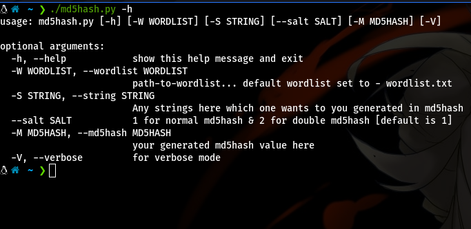
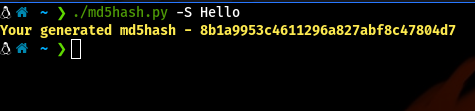
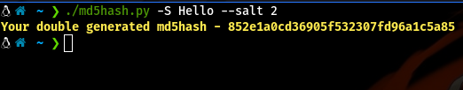
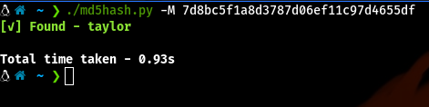
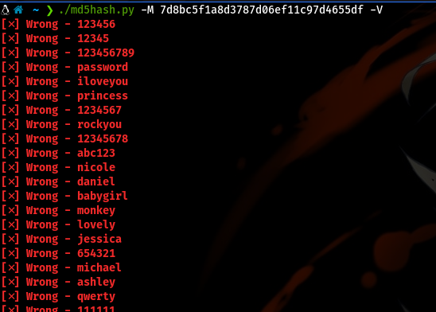
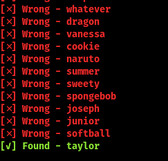
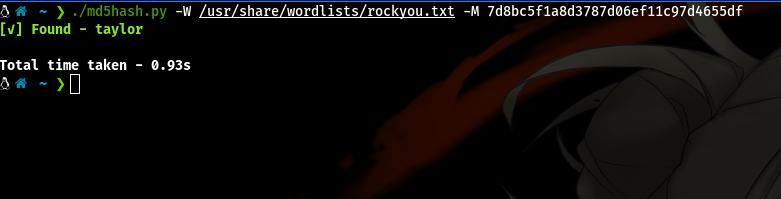
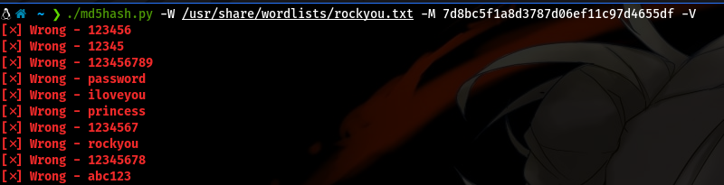
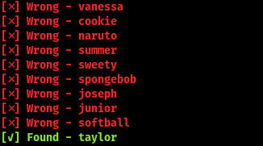

# MD5hash generator and cracker

* This is my first project on Github
> Author - Prakasaka
>> Date - 29/08/2020

## What is an MD5 hash?

An MD5 hash is created by taking a string of an any length and encoding it into a 128-bit fingerprint. Encoding the same string using the MD5 algorithm will always result in the same 128-bit hash output. MD5 hashes are also used to ensure the data integrity of files.


## Download and Setup

* Clone to local machine

```bash
$ git clone https://github.com/Prakasaka/md5hash_generator_and_cracker.git
$ cd md5hash_generator_and_cracker
$ chmod +x md5hash.py
```

| **Arguments** | **Help**
|------------- | -------------
| `-S/--string` | Any strings here which one wants to you generated in md5hash
| `--salt` | 1 for normal md5hash & 2 for double md5hash [default is 1]
| `-W/--wordlist` | path-to-wordlist... [default wordlist : rockyou.txt]
| `-M/--md5hash` | your generated md5hash value here
| `-V/--verbose` | for verbose mode


## USAGE

### Run script

* For usage
```bash
$ ./md5hash.py -h
	or
$ python3 md5hash.py -h
```


* For normal md5hash
```bash
$ ./md5hash.py [-S/--string] <string>
		or
$ python3 md5hash.py [-S/--string] <string>
```


* For double generated md5hash
```bash
$ ./md5hash.py [-S/--string] <string> --salt 2
		  or
$ python3 md5hash.py [-S/--string] <string> --salt 2
```


* Without verbose mode [default wordlistlist : rockyou.txt]
```bash
$ ./md5hash.py  [-M/--md5hash] <generated-md5hash-value>
			or
$ python3 md5hash.py [-M/--md5hash] <generated-md5hash-value>
```


* With verbose mode [default wordlistlist : rockyou.txt]
```bash
$ ./md5hash.py  [-M/--md5hash] <generated-md5hash-value> [-V/--verbose]
				or
$ python3 md5hash.py [-M/--md5hash] <generated-md5hash-value> [-V/--verbose]
```



* Wordlist without verbose mode
```bash
$ ./md5hash.py [-W/--wordlist] <path-to-wordlist> [-M/--md5hash] <generated-md5hash-value>
					or
$ python3 md5hash.py [-W/--wordlist] <path-to-wordlist> [-M/--md5hash] <generated-md5hash-value>
```


* Wordlist With verbose mode
```bash
$ ./md5hash.py [-W/--wordlist] <path-to-wordlist> [-M/--md5hash] <generated-md5hash-value> [-V/--verbose]
						or
$ python3 md5hash.py [-W/--wordlist] <path-to-wordlist> [-M/--md5hash] <generated-md5hash-value> [-V/--verbose]
```


